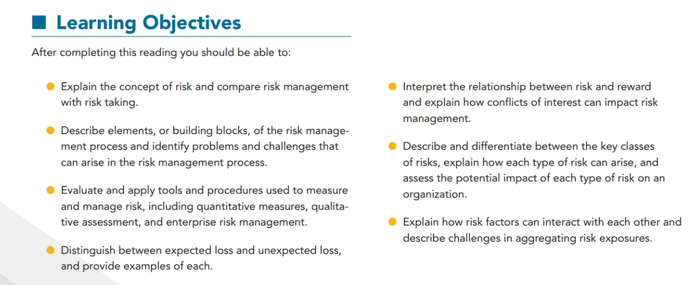
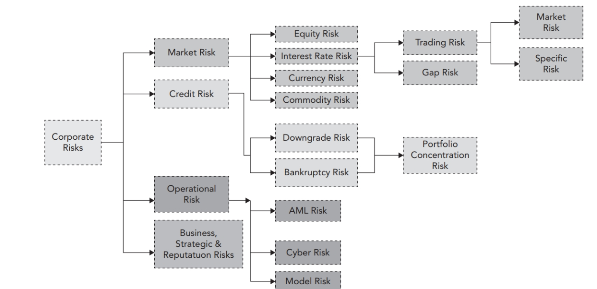
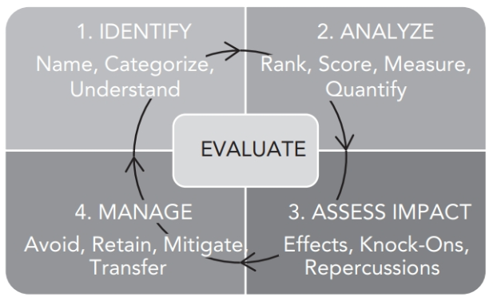
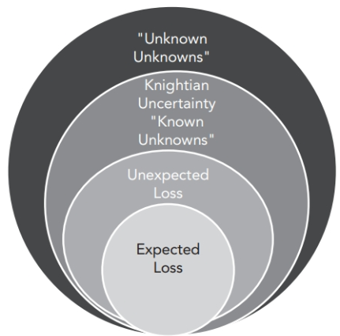
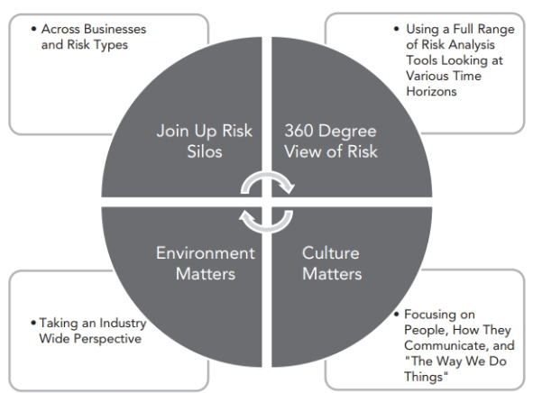

# The Building Blocks of Risk Management

LOS:

## Ten risk management building blocks

1. The risk management process
2. Identifying risk: knowns and unknowns
3. Expected loss, unexpected loss and tail loss
4. Risk factor breakdown
5. Structural change: from tail risk to systemic crisis
6. Human agency and conflicts of interest
7. Typology of risks and risk interactions
8. Risk aggregation
9. Balancing risk and reward
10. Enterprise risk management (ERM)

A typology of risk for banking industry

## Market Risk

Market risk arises due to the movements in market prices.

Price volatility is the engine of market risk.

Market risk is driven by the following:

1. **General market risk**: This is the risk that an asset class will fall in value, leading tofall in the value of an individual asset or portfolio.
2. **Specific market risk**: This is the risk that an individual asset will fall in value more than the general asset class.

## Credit Risk

Credit risk arises from the failure of one party tofulfill its financial obligations to another party.

## Liquidity Risk

Liquidity risk arises from risk of not having cash at the right time to pay obligations. It is used to describe two separate kinds of risk:

1. **Funding liquidity risk**: It is the risk that covers the risk that a firm cannot access enough liquid cash and assets to meet it's obligations.
2. **Market liquidity risk**: It is sometimes known as trading liquidity risk. It is the risk of a loss in asset value when markets temporarily seize up.

## Operational Risk

Operational risk can be defined as the "risk of loss resulting from inadequate or failed internal processes, people, and systems or from external events". It includes legal risk, but excludes business, strategic and reputational risk.

## Business and Strategic Risk

Business risk lie at the heart of any business and includes all the usual worries of firms, such as customer demand, pricing decisions, supplier negotiation, and managing product innovation.

Strategic risk is distinct from business risk. It involves making large, long-term decisions about the firm's direction, often accompanied by major investments of capital, human resources and management reputation.

## Reputational Risk

Reputational risk is the danger that a firm will suffer a sudden fall in it's market standing or brand with economic consequences.

The risk management process

1. **Avoid Risk**: There are risks that can be sidestepped by discontinuing the business or pursuing it using a different strategy.
2. **Retain Risk**: There are risks that can be retained within the firm's risk appetite.
3. **Mitigate Risk**: There are risks that can be mitigated by reducing exposure, frequency and severity.
4. **Transfer Risk**: There are risks that can be transferred to a third party using derivative products, structured products, or by paying a premium(insurance).

## Identifying Risk: Known and unknowns

Risk managers face the unknown and unexpected

**Expected Loss(EL)**: is the average loss a position taker might expect to incur form a position or portfolio.

EL = Probability of Default(PD) X Loss given default(LGD) X Exposure at default(EAD)

Where EL can be calculated with confidence, it can be treated as a variable cost or predictable expense rather than risk or uncertainty. The bank can make a profit by simply adding a price margin that covers the cost of EL.

## Expect the unexpected

Well behaved portfolios inevitably offer surprises. EL is created from good and bad days. On a bad day, losses can range above the expected level. The extent to which losses depart form the average is called the unexpected loss level.

## Tail Risk

Tail risk is the risk arising from extremely rare but very severe events.

In complex systems, extremely rare events can happen over long time periods, even if the structure remains structurally stable. These risks an extreme version of unexpected loss, are difficult tofind in data because there are not a lot of them.

Tail risks can be identified with long enough time series data and Extreme Value Theory(EVT).

## 3 lines of defense in risk management

1. **First Line**: Business line that generates, owns and manages risk
2. **Second Line**: Risk managers that specialize in risk management and day-to-day oversight.
3. **Third Line**: Periodic independent oversight and assurance, such as an internal audit.

## Value at Risk(VaR) and Expected Shortfall(ES)

VaR represents maximum potential loss in value of a portfolio of financial instruments with a given probability over a certain time horizon.

VaR only looks at the largest loss at a given likelihood thresh-old; it does not examine the size of losses beyond this thresh-old. For that reason, it is often said to ignore tail risk.

Bank regulators have tried to improve the way VaR is calculated, make its calculation across the industry more consistent and reliable, and strengthen the role of supplementary risk measures such as expected shortfall (ES) and worst-case scenario analysis.

## RAROC

$$Risk Adjusted Return On Capital(RAROC) = \frac{Reward}{Risk}$$

$$RAROC = \frac{After Tax Net Risk Adjusted Expected Return}{Economic Capital}$$

RAROC should be higher than the cost of equity capital (i.e., the hurdle rate or minimum return on equity capital required by the shareholders to be fairly compensated for risk).

RAROC allows for these 4 day to day application:

1. **Business comparision**: It allows to compare the performance of business lines that require different amounts of economic capital.
2. **Investment analysis**: RAROC can be used to predict likely returns from future investments.
3. **Pricing Strategies**: The firm can re-examine its pricing strategy for different customer segments and products. For example, it may have set prices too low to make a risk-adjusted profit in one business segment, while in another it may have the ability to reduce prices and increase market share (and overall profitability).
4. **Risk management cost/benefit analysis**: RAROC analyses can help a firm compare the cost of risk management (e.g., risk transfer via insurance, to the benefit of the firm).

## Enterprise Risk Management(ERM)

ERM:

## LOS based answers

### the concept of risk

#### LO 1.1: Explain the concept of risk and compare risk management with risk taking

- there is a natural trade-off between risk and return
- The more important concern is the variability of the loss, especially a loss that could rise to unexpectedly high levels or a loss that suddenly occurs that was not anticipated.
- risk management includes the sequence of activities aimed to reduce or eliminate an entity’s potential to incur expected losses.
- Risk taking refers specifically to the active assumption of incremental risk in order to generate incremental gains.

### the risk management process

#### LO 1.2: Describe the risk management process and identify problems and challenges that can arise in the risk management process

- Five steps:
  - Step 1: Identify the risks.
  - Step 2: Quantify and estimate the risk exposures or determine appropriate methods to transfer the risks.
  - Step 3: Determine the collective effects of the risk exposures or perform a cost-benefit analysis on risk transfer methods.
  - Step 4: Develop a risk mitigation strategy (i.e., avoid, transfer, mitigate, or assume risk).
  - Step 5: Assess performance and amend risk mitigation strategy as needed.
- Two key problems
  - identifying the correct risk(s)
  - finding an efficient method of transferring the risk
- Challenges:
  - risk must be sufficiently dispersed among willing and able participants in the economy
  - consistently assist in preventing market disruptions or preventing financial accounting fraud (due to corporate governance failures).
  - risk management may not be effective on an overall economic basis, a zero-sum game

### measure and manage risk

#### LO 1.3: Evaluate and apply tools and procedures used to measure and manage risk, including quantitative measures, qualitative assessment, and enterprise risk management

- Quantitative Measures
  - Value at risk (VaR) states a certain loss amount and its probability of occurring. VaR is a useful measure for liquid positions operating under normal market circumstances over a short period of time.
  - Economic capital refers to holding sufficient liquid reserves to cover a potential loss.
- Qualitative Assessment
  - Scenario analysis takes into account potential risk factors with uncertainties that are often non-quantifiable.
    - an adverse scenario or worst-case scenario analysis
  - Stress testing is a form of scenario analysis that examines a financial outcome based on a given “stress” on the entity.
- Enterprise Risk Management (ERM)
  - ERM considers entity-wide risks and tries to integrate risk considerations into key business decisions.

### expected loss and unexpected loss

#### LO 1.4: Distinguish between expected loss and unexpected loss, and provide examples of each

in advance, with ease, certainty

- Expected loss considers how much an entity expects to lose in the normal course of business.
- Unexpected loss considers how much an entity could lose outside of the normal course of business.
  - **correlation risk drives up the potential losses to unexpected levels** <- historical analysis

### risk and reward

#### LO 1.5: Interpret the relationship between risk and reward and explain how conflicts of interest can impact risk management

- variability of the potential reward.
  - The portion of the variability that is measurable as a probability function could be thought of as risk whereas the portion that is not measurable could be thought of as uncertainty.

### classes of risks

#### LO 1.6: Describe and differentiate between the key classes of risks, explain how each type of risk can arise, and assess the potential impact of each type of risk on an organization

- Market risk: how changes in market prices and rates will result in investment losses.
  - (1) interest rate risk
  - (2) equity price risk: volatility of stock prices, general market risk & specific risk
  - (3) foreign exchange risk: unhedged or not fully hedged foreign currency positions.
  - (4) commodity price risk
- Credit risk: a loss suffered by a party whereby the counterparty fails to meet its financial obligations to the party under the contract.
  - (1) default risk
  - (2) bankruptcy risk
  - (3) downgrade risk: publicly traded
  - (4) settlement risk
- Liquidity Risk
  - (1) funding liquidity risk
  - (2) trading liquidity risk
- Operational Risk: non-financial risk
- Legal and Regulatory Risk
- Business Risk: income statement
- Strategic risk
- Reputation Risk
  - (1) the general perceived trustworthiness of an entity
  - (2) the general perception that the entity engages in fair dealing and conducts business in an ethical manner.

### interaction between risks

#### Explain how risk factors can interact with each other and describe challenges in aggregating risk exposures

// TODO
